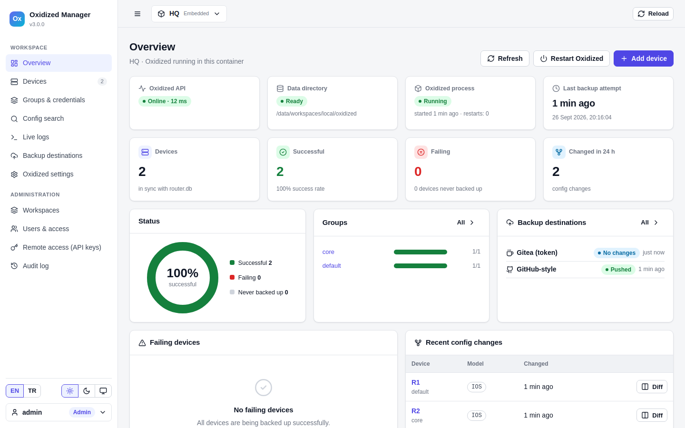
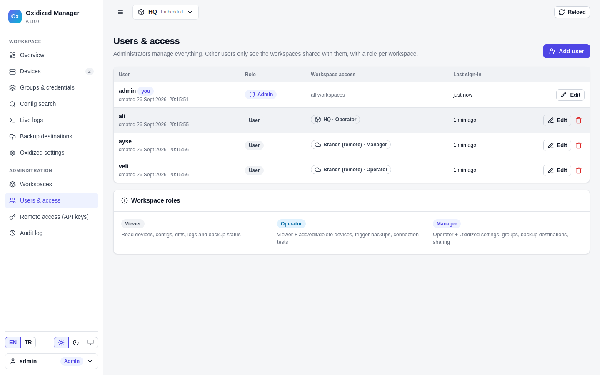
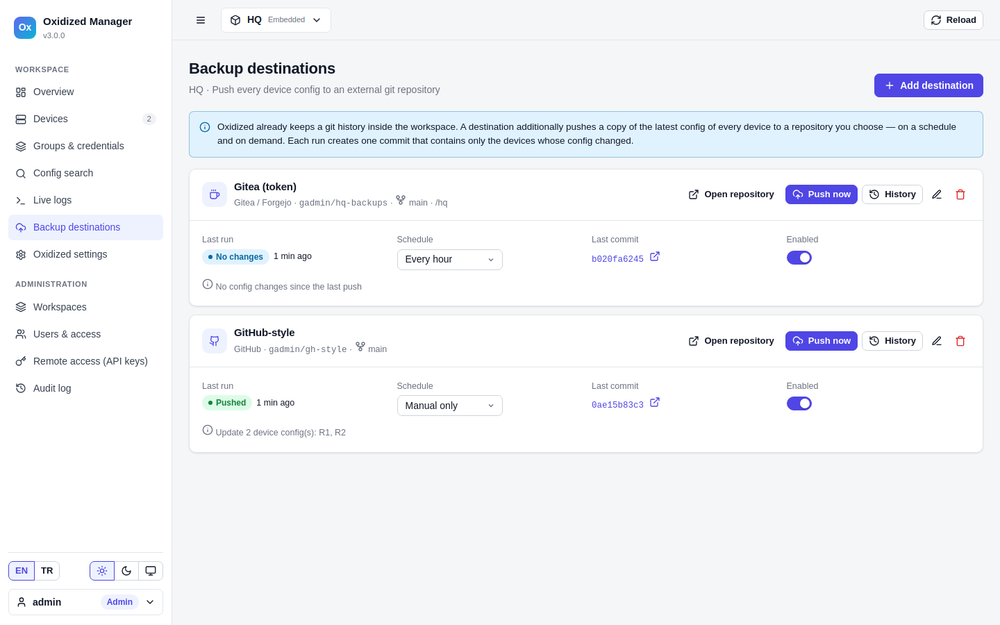
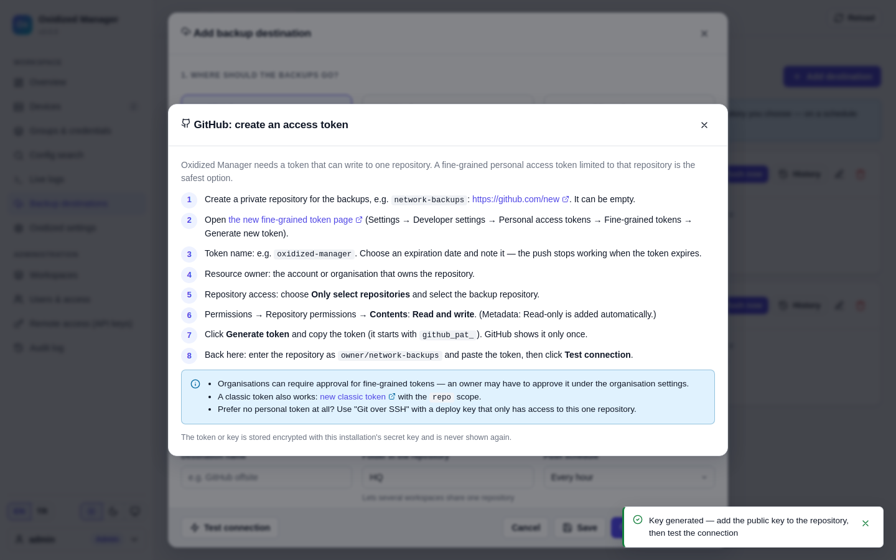

# Oxidized Manager

A web UI for [Oxidized](https://github.com/ytti/oxidized), the network device configuration backup tool.
Run it as a single container. It can:

- run its own embedded Oxidized,
- manage up to 10 remote Oxidized installations,
- give each user access only to the workspaces you share with them,
- push the collected configs to GitHub, GitLab, Gitea or any other git server.

The UI is in English and Turkish.



- [Features](#features)
- [Quick start](#quick-start)
- [Concepts](#concepts)
- [Managing a remote Oxidized](#managing-a-remote-oxidized)
- [Users and sharing](#users-and-sharing)
- [Backup destinations (GitHub, GitLab, …)](#backup-destinations)
- [Configuration](#configuration)
- [Security notes](#security-notes)
- [Migrating an existing Oxidized](#migrating-an-existing-oxidized)
- [Development](#development)
- [Relationship to Oxidized & license](#relationship-to-oxidized--license)

Türkçe: [README.tr.md](README.tr.md)

## Features

- **Devices**
  - Add, edit, duplicate and delete devices, including bulk edit and bulk delete.
  - Import and export CSV or raw `router.db`.
  - Credentials follow Oxidized precedence: device → group + model → group → global.
- **Configs**
  - Syntax-highlighted config view and search across all configs.
  - Version history with unified or side-by-side diff.
- **Debugging**
  - A live connection test that uses exactly the credentials and ports Oxidized would use.
  - A per-device live log, and Oxidized `input.debug` files.
- **Oxidized settings**
  - Form-based editor for groups, `model_map` and the `router.db` schema, plus a raw YAML editor.
  - Every change is backed up first and comments are preserved.
- **Embedded Oxidized**
  - Runs as a supervised child process with start, stop and restart.
  - Restarts automatically after a crash and streams its live log.
- **Remote workspaces**
  - Manage Oxidized on other servers over HTTPS with an API key. No SSH tunnel is needed.
- **Users**
  - Administrators and users, with a viewer, operator or manager role per workspace.
  - Profile with name, e-mail and Gravatar photo; password reset by e-mail over your SMTP server.
  - Audit log.
- **Backup destinations**
  - Scheduled or on-demand pushes to GitHub, GitLab, Gitea/Forgejo, any HTTPS git server, or any SSH git server with a generated deploy key.
  - The UI shows a step-by-step guide for creating the token or key.
- **UI**
  - English and Turkish, light and dark theme, works on mobile.

## Quick start

You need Docker with the compose plugin.

```bash
git clone https://github.com/tmrhnoztrkk/oxidized-manager.git
cd oxidized-manager
cp .env.example .env    # optional, every setting has a default
docker compose up -d --build
```

Open `http://SERVER:8080`. The first visit starts a setup wizard with three steps:

1. **Language and administrator account.**
2. **What this installation manages:**
   - **Run Oxidized here.** Starts an embedded Oxidized from a fresh configuration: default credentials, interval, model, protocol, threads, git author, and optionally the first device.
   - **Manage a remote Oxidized.** See [Managing a remote Oxidized](#managing-a-remote-oxidized).
   - **Skip for now.** Opens the panel without a workspace; add workspaces and users later under *Administration*.
3. **Done.** Add devices, users and backup destinations.

### Data, updates and backups

Everything (users, workspaces, Oxidized configuration and git history, `.secret_key`) is stored in the Docker volume `oxidized-manager-data`, not in the project folder. Updates, `docker compose down`, or a fresh clone in another folder keep it.

Update:

```bash
git pull
docker compose up -d --build
```

> [!WARNING]
> `docker compose down -v` and `docker volume rm oxidized-manager-data` delete all data.

Back up the volume, including `.secret_key`: stored tokens cannot be decrypted without it.

```bash
docker run --rm -v oxidized-manager-data:/data -v "$PWD":/backup alpine tar czf /backup/oxmgr-data.tgz -C /data .
# restore into an empty volume:
docker run --rm -v oxidized-manager-data:/data -v "$PWD":/backup alpine tar xzf /backup/oxmgr-data.tgz -C /data
```

Up to 3.0.0 the data was stored in `./data`. On the first start with an empty volume, an existing `./data` in the project folder is copied into the volume automatically. `./data` itself is left untouched.

## Concepts

| Term | Meaning |
|---|---|
| **Installation** | One `oxidized-manager` container with its own users. |
| **Workspace** | One Oxidized installation that the panel manages. |
| **Embedded workspace** | The Oxidized running inside this container. There is at most one per installation. |
| **Remote workspace (Oxidized Manager)** | The embedded workspace of another installation, reached over HTTPS with an API key. You get full management of it. At most `MAX_REMOTE_WORKSPACES` (default 10). |
| **Remote workspace (plain Oxidized API)** | Any Oxidized with `oxidized-web` enabled. You can view status, configs, versions and diffs, search, and push to backup destinations. It is read-only: devices and settings cannot be edited. |

Example setup:

- **Headquarters** runs one container with an embedded Oxidized for its own devices.
- It also manages two branch offices remotely.
- Each branch runs the same image with its own embedded Oxidized.

```
 HQ installation                                  Branch installation (same image)
┌───────────────────────────────────────┐ HTTPS  ┌──────────────────────────────┐
│ UI/API ─ embedded Oxidized (WS 1)     │ ─────► │ API ─ embedded Oxidized      │
│   ├─ remote workspace "Branch" (WS 2) │ Bearer │   (API key, full or read)    │
│   └─ backup destinations ──► GitHub   │  key   └──────────────────────────────┘
└───────────────────────────────────────┘
```

## Managing a remote Oxidized

1. On the remote server, start Oxidized Manager and choose **Run Oxidized here** in the wizard.
2. On the remote server, go to **Administration → Remote access (API keys) → Create key**.
   - *Full* scope allows management; *read-only* allows monitoring only.
   - The key is shown only once.
3. On the managing installation, go to **Administration → Workspaces → Add remote workspace**.
   - Enter the remote address (for example `https://oxidized.branch.example.com`) and the key.
   - Click **Test connection**, then **Add workspace**.

API keys only reach the embedded workspace of the installation that issued them. They cannot manage users or keys.

Actions made through a key show up in the remote audit log as `api:<key name> (<user>)`.

To attach an existing plain Oxidized instead, choose **Plain Oxidized REST API** and enter its `oxidized-web` address, for example `http://10.0.0.5:8888`.

## Users and sharing



- **Administrators** manage users, workspaces and API keys, and have full access to every workspace.
- **Users** only see the workspaces shared with them. Each shared workspace gives them one of these roles:

| Role | Can |
|---|---|
| **Viewer** | Read devices, configs, versions and diffs, live logs, and backup destination status |
| **Operator** | Viewer, plus add/edit/delete/import devices, trigger backups, run connection tests, reveal device passwords, and trigger destination pushes |
| **Manager** | Operator, plus Oxidized settings, groups, process start/stop, backup destinations, and sharing the workspace with other users |

There are two places to set access:

- **Administration → Users & access**: create an account and set its access to every workspace at once.
- **Share** on a workspace card: add or remove users of that one workspace. Workspace managers can do this too.

Disabling an account ends its sessions immediately.

### Profile and password reset

- **Profile.** The account menu at the bottom left (**My profile**) edits the first and last name, the e-mail address and the password. When the e-mail address has a [Gravatar](https://gravatar.com), its photo is shown; otherwise the initials are. Administrators can also set these fields under *Users & access*.
- **Forgot your password?** On the sign-in page, a user enters their username or e-mail address and receives a link that is valid for one hour and works once. The answer is the same whether or not the account exists, and each account gets at most one e-mail per minute.
- **Setup.** Under **Administration → E-mail (SMTP)**, enter the mail server (STARTTLS, SSL/TLS or none), the sender and the panel address that the links point to, then use **Send test e-mail**. Users need an e-mail address in their profile to receive a link; without SMTP the sign-in page asks them to contact an administrator.

## Backup destinations



Oxidized already keeps a git history inside each workspace. A **backup destination** additionally pushes the latest config of every device to a repository you choose. It runs on a schedule (every 15 min … once a day) or when you click **Push now**.

It works for embedded and remote workspaces alike. For remote ones, the configs are pulled over the remote API and pushed from this installation.

| Provider | Authentication |
|---|---|
| **GitHub** (and GitHub Enterprise) | Fine-grained personal access token limited to the repository, with *Contents: Read and write* |
| **GitLab** (gitlab.com or self-managed) | Project access token with `write_repository` |
| **Gitea / Forgejo / Codeberg** | Access token with *repository: Read and write* |
| **Git over HTTPS** (Bitbucket, Azure DevOps, CodeCommit, …) | Username + password, app password or token |
| **Git over SSH** (any server) | Ed25519 deploy key generated in the UI; add the public key with write access |

Every provider has a **How do I get a token?** guide in the form, and **Test connection** checks that the credentials can push before you save.



What ends up in the repository (folder `hq/` in this example):

```
hq/
├── core/            # one folder per Oxidized group (or everything flat)
│   └── CORE-SW01    # the device config as collected by Oxidized
├── EDGE-FW01        # devices without a group
├── devices.csv      # inventory: name, ip, model, group, file — no passwords
└── .oxidized-manager.json
```

- **Commits.** Each run makes one commit that touches only the devices whose config changed; a run without changes makes no commit.
- **Deleted devices.** By default their files are removed. You can switch this off per destination.
- **Failed reads.** If a device could not be read, its previous copy is kept.
- **Folder.** The folder can be empty (repository root). Using a different folder per workspace lets several workspaces share one repository.
- **Credentials.**
  - Tokens and keys are encrypted with the installation's secret key and never sent back to the browser.
  - For HTTPS, the token is passed to git through environment variables, not stored in `.git/config`.
  - SSH host keys are trusted on first use and pinned afterwards.

## Configuration

Set these in `.env`. All are optional.

| Variable | Default | Description |
|---|---|---|
| `SECRET_KEY` | generated in `.secret_key` in the data volume | Signs sessions and encrypts stored secrets |
| `MANAGER_PORT` | `8080` | Published port |
| `SESSION_HOURS` | `12` | Session lifetime |
| `SECURE_COOKIES` | `false` | Set `true` behind HTTPS |
| `FORWARDED_ALLOW_IPS` | `127.0.0.1` | Reverse proxy address whose `X-Forwarded-*` headers are trusted |
| `MAX_REMOTE_WORKSPACES` | `10` | Remote workspaces per installation |
| `DEFAULT_LANG` | `en` | Default UI language (`en`, `tr`) when the browser does not ask for one |
| `BACKUP_SCHEDULER` | `true` | Run scheduled destination pushes |
| `OXIDIZED_VERSION` | `latest` | Tag of the `oxidized/oxidized` base image |

## Security notes

- **HTTPS.** Publish the panel behind a TLS reverse proxy (nginx, Traefik, Caddy) and set `SECURE_COOKIES=true` and `FORWARDED_ALLOW_IPS`. This matters especially when remote workspaces connect over the internet.
- **Passwords.** Panel passwords are hashed with scrypt.
- **Stored secrets.** Remote API keys, git tokens, SSH keys and the SMTP password are stored encrypted (Fernet).
- **Password reset links.** They are single-use, expire after one hour and are stored only as SHA-256 hashes. They point to the configured panel address, never to the address of the request.
- **API keys.** They are stored as SHA-256 hashes and shown only once.
- **Audit log.** Revealing a device or group password and exporting with passwords are both recorded.
- **Permissions.** Every workspace request is checked centrally against the caller's role before it reaches Oxidized or is proxied to a remote installation.
- **Reporting.** See [SECURITY.md](SECURITY.md) to report a vulnerability.

## Migrating an existing Oxidized

1. Start Oxidized Manager and create an embedded workspace.
2. Go to **Devices → Tools → Import CSV / paste router.db**. Use **Preview** first. There are two ways to bring devices over:
   - **CSV with a header** (`name,ip,model,group,username,password,…`). This works regardless of your old column layout.
   - **Raw `router.db` lines.** These are parsed with the *current* schema, whose default delimiter is `|`. If your old file uses another delimiter or column order (for example `name:ip:model:group`), first copy your old `source.csv` block into **Config (YAML)**, or convert the file to CSV.
3. Go to **Oxidized settings → Config (YAML)** and copy over the parts of your old config you need, for example groups, `model_map` and `vars`.
   - Keep the `source`, `output` and `extensions.oxidized-web` sections generated by the manager.
   - **Groups & credentials** and **Schema** show whether the result is consistent.

Alternatively, attach the running Oxidized as a **plain Oxidized REST API** workspace and push its configs to a backup destination without changing anything.

## Development

```text
app/                 FastAPI backend (Python 3.11+)
  main.py            app, middleware order, scheduler
  perms.py           roles + the single permission rule table
  routes_*.py        API routes (admin, workspace, backup destinations)
  workspace.py       workspace context + proxy for remote managers
  backup.py          collecting configs + git push engine
  locales/tr.py      Turkish API messages
static/              vanilla JS single-page app (no build step)
  js/locales/tr.js   Turkish UI strings
tests/               pytest unit/API tests
tests/e2e/           docker compose test bed: 2 managers, fake IOS devices, Gitea
tools/i18n_check.py  finds untranslated strings
```

```bash
python -m venv .venv && . .venv/bin/activate
pip install -r requirements-dev.txt
pytest -q                       # unit + API tests
python tools/i18n_check.py      # every UI/API string must be translated
tests/e2e/run.sh                # full end-to-end run (needs Docker, ~2 min)
KEEP=1 tests/e2e/run.sh && python tests/e2e/ui_tour.py   # browser tour (Playwright)
```

To run the backend without Docker:

```bash
DATA_DIR=./data OXIDIZED_BIN=$(which oxidized) uvicorn app.main:app --reload
```

This needs the `oxidized` and `oxidized-web` gems installed.

**Adding a language:**

1. Copy `static/js/locales/tr.js` and `app/locales/tr.py`.
2. Translate the values.
3. Register the language in `static/js/i18n.js` (`LANGS`, `CATALOGS`), `app/i18n.py` (`LANGS`) and `tools/i18n_check.py`.

Pull requests are welcome, see [CONTRIBUTING.md](CONTRIBUTING.md).

## Relationship to Oxidized & license

Oxidized Manager is an independent project built on top of [Oxidized](https://github.com/ytti/oxidized) by Saku Ytti and contributors.

- It does not modify Oxidized.
- The image is based on the official `oxidized/oxidized` image and drives Oxidized through its configuration files and the `oxidized-web` REST API.
- Oxidized updates arrive by rebuilding with a newer `OXIDIZED_VERSION`.

Oxidized Manager is licensed under the [Apache License 2.0](LICENSE), the same license as Oxidized. See [NOTICE](NOTICE).
