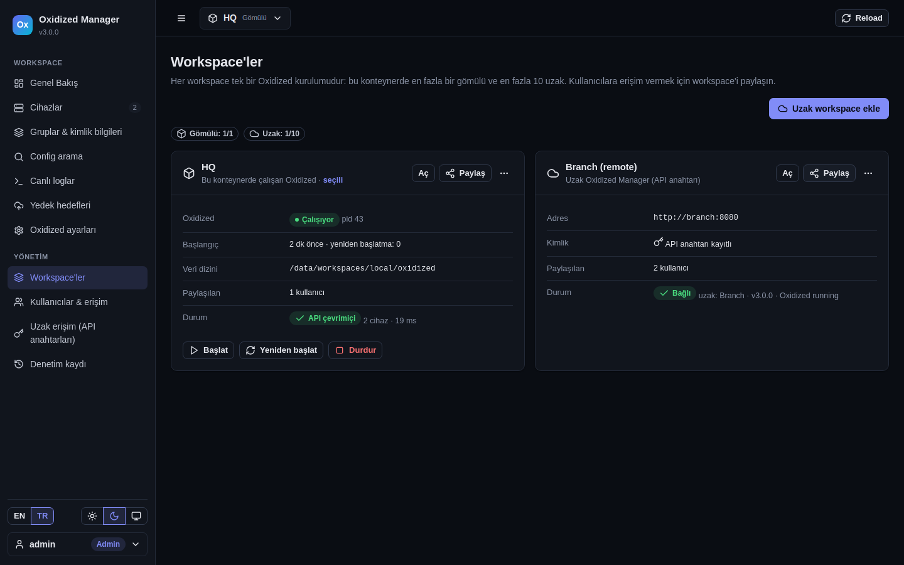

# Oxidized Manager

Ağ cihazı config yedekleme aracı [Oxidized](https://github.com/ytti/oxidized) için web arayüzü. Tek bir konteyner olarak çalışır ve şunları yapar:

- Kendi gömülü Oxidized'ini çalıştırabilir.
- En fazla 10 uzak Oxidized kurulumunu yönetebilir.
- Kullanıcılar yalnızca kendileriyle paylaşılan workspace'lere erişir.
- Toplanan configleri GitHub, GitLab, Gitea veya herhangi bir git sunucusuna gönderir.

Arayüz Türkçe ve İngilizcedir.

English: [README.md](README.md)



## Özellikler

- **Cihazlar**
  - Ekleme, düzenleme, kopyalama, silme; toplu düzenleme ve toplu silme.
  - CSV veya ham `router.db` içe/dışa aktarma.
  - Kimlik bilgilerinde Oxidized önceliği geçerlidir: cihaz → grup + model → grup → global.
- **Configler**
  - Renklendirilmiş config görünümü ve tüm configlerde arama.
  - Versiyon geçmişi; birleşik veya yan yana diff.
- **Hata ayıklama**
  - Oxidized'in kullanacağı kimlik bilgisi ve portlarla canlı bağlantı testi.
  - Cihaza özel canlı log ve Oxidized `input.debug` dosyaları.
- **Oxidized ayarları**
  - Gruplar, `model_map` ve `router.db` şeması için form tabanlı düzenleyici; ayrıca ham YAML düzenleyici.
  - Her değişiklikten önce yedek alınır, yorumlar korunur.
- **Gömülü Oxidized**
  - Başlat / durdur / yeniden başlat destekli, denetlenen bir alt süreç olarak çalışır.
  - Çökünce otomatik yeniden başlar, canlı log akışı vardır.
- **Uzak workspace'ler**
  - Başka sunuculardaki Oxidized'ler HTTPS + API anahtarıyla yönetilir. SSH tüneli gerekmez.
- **Kullanıcılar**
  - Yöneticiler ve kullanıcılar; her workspace için izleyici, operatör veya yönetici rolü.
  - Denetim kaydı.
- **Yedek hedefleri**
  - GitHub, GitLab, Gitea/Forgejo, herhangi bir HTTPS git sunucusu veya üretilen deploy key ile herhangi bir SSH git sunucusu.
  - Zamanlanmış veya anlık gönderim.
  - Token ya da anahtarın nasıl alınacağını adım adım anlatan rehber pencereler.
- **Arayüz**
  - Türkçe/İngilizce, açık/koyu tema, mobil uyumlu.

## Hızlı başlangıç

Docker ve compose eklentisi gerekir.

```bash
git clone https://github.com/tmrhnoztrkk/oxidized-manager.git
cd oxidized-manager
cp .env.example .env
docker compose up -d --build
```

`http://SUNUCU:8080` adresini açın. İlk açılışta kurulum sihirbazı gelir:

1. **Dil ve yönetici hesabı.**
2. **Bu kurulum neyi yönetecek?**
   - **Oxidized'i burada çalıştır.** Sıfırdan bir gömülü Oxidized kurar. Varsayılan kimlik bilgileri, aralık, model, protokol, thread sayısı, git yazarı ve isteğe bağlı olarak ilk cihaz sorulur.
   - **Uzak bir Oxidized'i yönet.** Aşağıdaki "Uzak Oxidized'i yönetmek" bölümüne bakın.
   - **Şimdilik atla.** Panel workspace olmadan açılır; workspace ve kullanıcıları sonra *Yönetim* bölümünden eklersiniz.
3. Cihazları, kullanıcıları ve yedek hedeflerini ekleyin.

Tüm veriler `./data` altında durur. Bu dizini `data/.secret_key` dahil yedekleyin; bu dosya olmadan kayıtlı token'lar çözülemez.

## Kavramlar

| Terim | Anlamı |
|---|---|
| **Kurulum** | Kendi kullanıcıları olan tek bir `oxidized-manager` konteyneri |
| **Workspace** | Panelin yönettiği bir Oxidized kurulumu |
| **Gömülü workspace** | Bu konteynerin içinde çalışan Oxidized. Kurulum başına en fazla 1 tane olabilir. |
| **Uzak workspace (Oxidized Manager)** | Başka bir kurulumun gömülü workspace'i. HTTPS + API anahtarıyla bağlanılır, tam yönetim sağlar. En fazla `MAX_REMOTE_WORKSPACES` (varsayılan 10). |
| **Uzak workspace (düz Oxidized API)** | `oxidized-web` açık olan herhangi bir Oxidized. Salt okunurdur: durum, configler, versiyonlar, diff, arama ve yedek hedefleri kullanılabilir; cihaz ve ayar düzenlenemez. |

Örnek: Merkezdeki konteyner, merkez cihazları için bir gömülü Oxidized çalıştırır ve iki şubeyi uzaktan yönetir. Şubelerde de aynı imaj, kendi gömülü Oxidized'iyle çalışır.

## Uzak Oxidized'i yönetmek

1. **Uzak sunucuda:**
   1. Oxidized Manager'ı kurun ve sihirbazda **Oxidized'i burada çalıştır** seçeneğini seçin.
   2. **Yönetim → Uzak erişim (API anahtarları) → Anahtar oluştur** adımıyla bir anahtar üretin. Yetki *tam* veya *salt okunur* olabilir. Anahtar yalnızca bir kez gösterilir.
2. **Yöneten kurulumda:**
   1. **Yönetim → Workspace'ler → Uzak workspace ekle** adımına gidin.
   2. Adresi ve anahtarı girin.
   3. **Bağlantıyı test et**, ardından **Workspace ekle**.

API anahtarları yalnızca kendilerini üreten kurulumun gömülü workspace'ine erişebilir; kullanıcı veya anahtar yönetemez. Anahtarla yapılan işlemler uzak denetim kaydında `api:<anahtar adı> (<kullanıcı>)` olarak görünür.

## Kullanıcılar ve paylaşım

- **Yöneticiler** kullanıcıları, workspace'leri ve API anahtarlarını yönetir; tüm workspace'lere tam erişimleri vardır.
- **Kullanıcılar** yalnızca kendileriyle paylaşılan workspace'leri görür. Her workspace'te şu rollerden biri olur:

| Rol | Yetkileri |
|---|---|
| **İzleyici** | Cihazlar, configler, versiyonlar ve diff, canlı loglar, yedek hedefi durumu |
| **Operatör** | İzleyicinin yetkileri, ayrıca cihaz ekleme/düzenleme/silme/içe aktarma, yedek tetikleme, bağlantı testi, cihaz şifresi görüntüleme, hedef gönderimi tetikleme |
| **Yönetici** | Operatörün yetkileri, ayrıca Oxidized ayarları, gruplar, süreç kontrolü, yedek hedefleri, workspace'i paylaşma |

Erişim iki yerden verilir:

- **Yönetim → Kullanıcılar & erişim:** hesap oluşturulur ve tüm workspace erişimleri tek ekrandan ayarlanır.
- **Workspace kartındaki "Paylaş" düğmesi:** o workspace'e kullanıcı eklenir veya çıkarılır. Bunu workspace yöneticileri de yapabilir.

Pasifleştirilen hesabın oturumları anında sonlanır.

## Yedek hedefleri

Oxidized her workspace içinde zaten bir git geçmişi tutar. **Yedek hedefi** ise her cihazın son config'ini sizin seçtiğiniz bir repoya ayrıca gönderir. Gönderim zamanlanmış olarak (15 dakikada bir … günde bir) veya **Şimdi gönder** ile yapılır.

- **Uzak workspace'ler:** Configler uzak API'den çekilir ve bu kurulumdan gönderilir.
- **Kurulum rehberi:** Her sağlayıcının formunda **Token nasıl alınır?** rehberi vardır.
- **Bağlantı testi:** **Bağlantıyı test et**, kaydetmeden önce kimlik bilgilerinin push yapabildiğini doğrular.

| Sağlayıcı | Kimlik doğrulama |
|---|---|
| **GitHub** (Enterprise dahil) | Yalnızca o repoyla sınırlı, *Contents: Read and write* yetkili fine-grained token |
| **GitLab** | `write_repository` yetkili proje erişim token'ı |
| **Gitea / Forgejo / Codeberg** | *repository: Read and write* yetkili erişim token'ı |
| **Git over HTTPS** (Bitbucket, Azure DevOps, …) | Kullanıcı adı + şifre / uygulama şifresi / token |
| **Git over SSH** | Arayüzde üretilen Ed25519 deploy key; açık anahtar yazma yetkisiyle eklenir |

Gönderim kuralları:

- **Commit:** Her çalışma tek bir commit oluşturur ve yalnızca config'i değişen cihazları içerir. Değişiklik yoksa commit atılmaz.
- **Silinen cihazlar:** Dosyaları varsayılan olarak kaldırılır; bu hedef bazında kapatılabilir.
- **Okunamayan cihazlar:** Önceki kopyaları korunur.
- **Envanter:** Şifresiz envanter `devices.csv` olarak yazılır.

## Ayarlar (`.env`)

| Değişken | Varsayılan | Açıklama |
|---|---|---|
| `SECRET_KEY` | `data/.secret_key` içinde üretilir | Oturumları imzalar, kayıtlı sırları şifreler |
| `MANAGER_PORT` | `8080` | Yayın portu |
| `SECURE_COOKIES` | `false` | HTTPS arkasında `true` yapın |
| `FORWARDED_ALLOW_IPS` | `127.0.0.1` | Güvenilen reverse proxy adresi |
| `MAX_REMOTE_WORKSPACES` | `10` | Kurulum başına uzak workspace sayısı |
| `DEFAULT_LANG` | `en` | Varsayılan arayüz dili (`en`, `tr`) |
| `BACKUP_SCHEDULER` | `true` | Zamanlanmış gönderimler |
| `OXIDIZED_VERSION` | `latest` | `oxidized/oxidized` imaj etiketi |

## Mevcut Oxidized'den geçiş

1. Gömülü workspace oluşturun.
2. **Cihazlar → Araçlar → CSV içe aktar** ile cihazları aktarın. Önce **Önizle** ile kontrol edin.
   - **Başlıklı CSV** (`name,ip,model,group,username,password,…`): eski kolon düzeninden bağımsız çalışır.
   - **Ham `router.db` satırları:** *mevcut* şemaya göre okunur (varsayılan ayırıcı `|`). Eski dosyanız farklı bir ayırıcı veya kolon sırası kullanıyorsa (örn. `name:ip:model:group`), önce eski `source.csv` bloğunu **Config (YAML)** sekmesine taşıyın.
3. Grupları, `model_map` ve `vars` bölümlerini **Oxidized ayarları → Config (YAML)** üzerinden aktarın.

Mevcut Oxidized'e dokunmak istemiyorsanız, onu **düz Oxidized REST API** workspace'i olarak bağlayıp yalnızca yedek hedefine gönderebilirsiniz.

## Geliştirme ve testler

```bash
pip install -r requirements-dev.txt
pytest -q                     # birim + API testleri
python tools/i18n_check.py    # çevrilmemiş metin kalmamalı
tests/e2e/run.sh              # uçtan uca: 2 kurulum, sahte IOS cihazları, Gitea
```

## Oxidized ile ilişkisi ve lisans

Oxidized Manager, [Oxidized](https://github.com/ytti/oxidized) üzerine kurulu bağımsız bir projedir.

- Oxidized'in kodunu değiştirmez.
- Resmi `oxidized/oxidized` imajını temel alır.
- Oxidized'i config dosyaları ve `oxidized-web` REST API'si üzerinden yönetir.

Lisans: [Apache 2.0](LICENSE), Oxidized ile aynı. Ayrıntılar için [NOTICE](NOTICE) dosyasına bakın.
